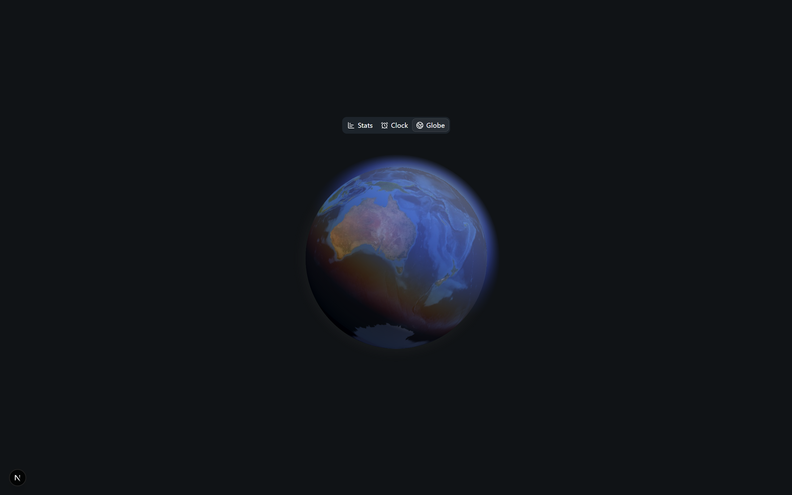

# Study Clock (The most overengineered clock to ever be dreamed of)

Timer to help track effective studying time and break time.

This is based off of the 1st helpful studying method described in this [video, "Marty Lobdell - Study Less Study Smart"]( https://www.youtube.com/watch?v=IlU-zDU6aQ0] )

## Stuff that works

 - Silky coconut oil laced with baby powder smooth animations (okay maybe its not that smooth but I'd say its pretty good)
 
 - Cracked statistics manager
 
 - Most creamy earth simulation with geosync to current location
